## DIRECTORY STRUCTURE

- Source Folder (/src/... ):

  - All the resources generated by the team for our application reside within this directory.
  - This is the core application source code.

- Components folder (/src/components/... ):

  - The components folder contains a collection of UI components like loginForm, buttons, lists etc that are shared and used across files in the project.
  - Contains a "common" folder for components that are used across the whole app
  - Other components should be categorized based on pages or features

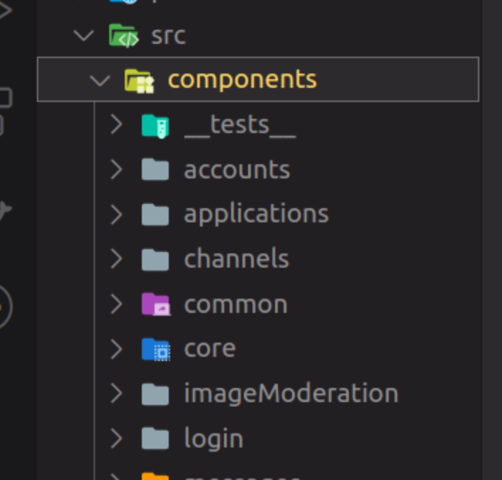

- Layouts folder (/src/layouts/... ):

  - Contains the layout related files such as Navbar, Footer, Content...
  - Also authenticated, admin or public layouts.

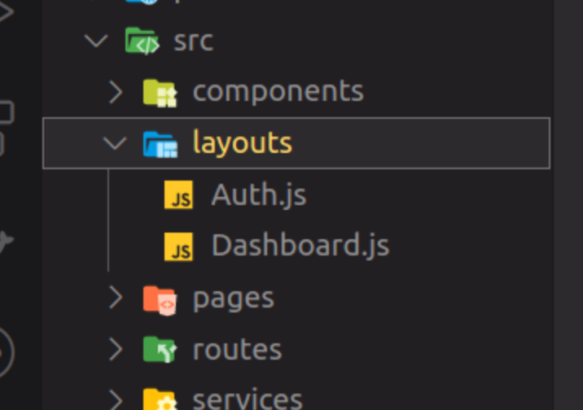

- Pages folder (/src/pages/... ):

  - The pages folder reflects the routes of the application.
  - No components reside in the pages folder

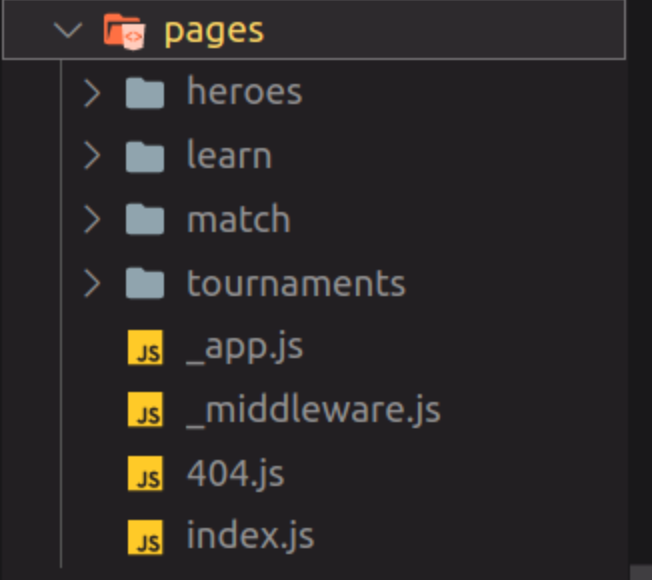

- api folder (src/api/...):

  - Manage all api requests here. You can see them as a bridge or an adapter between the database server APIs and the view layer (pages and components) of our application.

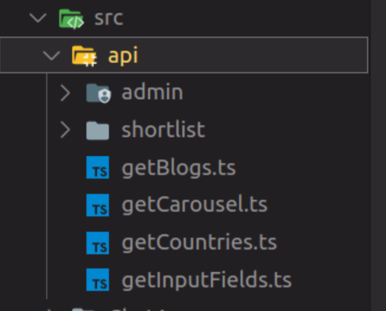

- Utils folder (src/utils/...)

  - The utils folder is just a place to locate some utility functions that are used repeatedly in the project. Files in the utils folder only contain some functions like date formatting, string conversion.

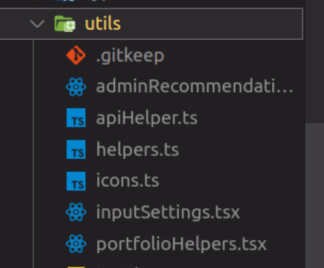

- Styles Folder (src/styles/...)

  - Individual components will have a scoped css file and all the css is defined under the Style folder.

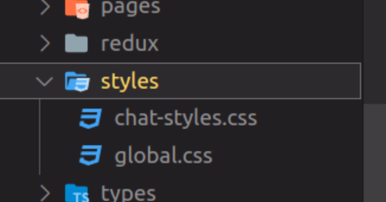

- Hooks Folder (src/hooks/...)

  - The hooks folder contains every single custom hook in your entire project. This is a useful folder to have in any size project since almost every project will have multiple custom hooks so having a single place to put them all is really useful.

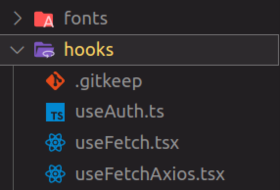

- Types Folder (src/types/...)

  - Types for typescript

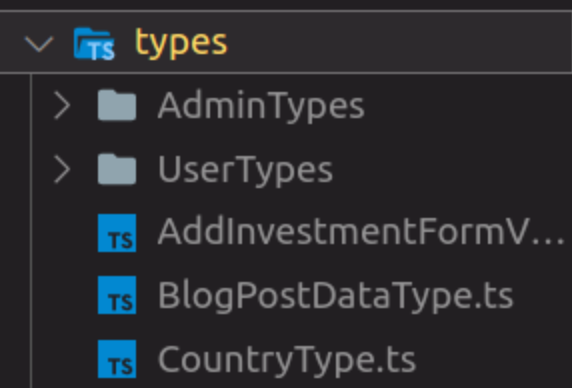

- Constants folder (src/constants/...)

  - Constant variables for the project

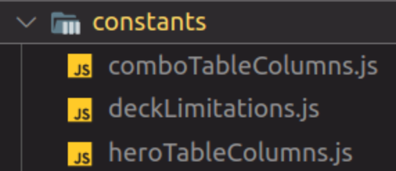

- contexts folder (src/contexts/...)

  - The context folder stores all your React context files that are used across multiple pages.

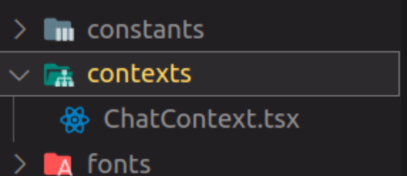

- assets folder (src/assets/...)

  - The assets folder contains all images, css files, font files, etc. for your project. Pretty much anything that isn't code related will be stored in this folder.

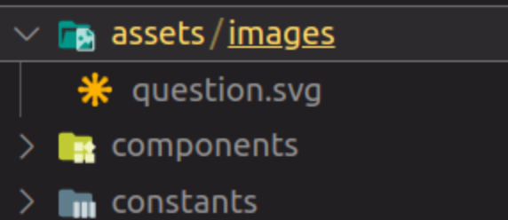

- lib folder (src/lib/...)

  - The lib folder is another fairly simple folder. This folder contains facades for the various different libraries you use in your project. For example, if you use the axios library then this folder would contain a file for that axios library that creates your own API overtop of the axios API which you then use in your application. This means that instead of importing axios directly in your project you would import the file from this folder associated with axios.

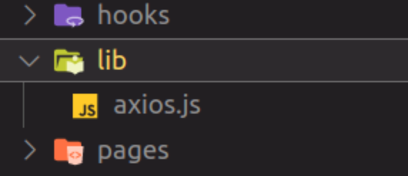
